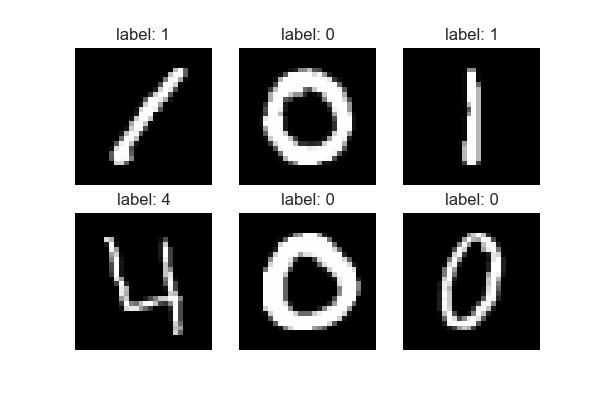
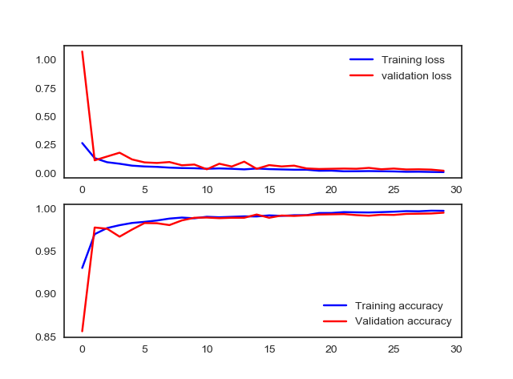
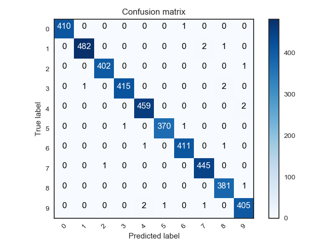

# kaggle学习之路 #
> kaggle解决问题的套路流程

1. 链接场景和目标
2. 链接评估准则
3. 认识数据
4. 数据预处理（清洗、调权）
5. 特征工程
6. 模型调参
7. 模型状态分析
8. 模型融合

> 数据预处理

* 数据清洗
    * 去掉样本数据的异常数据。（比如连续型数据中的离群点）
    * 去除缺失大量特征的数据
* 数据采样
    * 下/上采样（假设正负样本比例1:100，把正样本的数量重复100次，这就叫上采样，也就是把比例小的样本放大。下采样同理，把比例大的数据抽取一部分，从而使比例变得接近于1；1）
    * 保证样本均衡
* 工具 sql、pandas等

[**手写数字识别**](https://www.kaggle.com/c/digit-recognizer "手写数字识别")

分别使用了以下几种方法：

1. [**knn项目代码**](Digit_Recognizer/knn.py)
2. [**svm项目代码**](Digit_Recognizer/svm.py)
3. [**随机网络项目代码**](Digit_Recognizer/random_forest.py)
4. [**神经网络（用scikit-learn）项目代码**](Digit_Recognizer/nn_sk.py)
5. [**神经网络（用keras）项目代码**](Digit_Recognizer/nn_keras.py)
6. [**cnn项目代码（用keras编写，使用dropout）**](Digit_Recognizer/cnn_dropout.py)
7. [**cnn项目代码（用keras编写，使用BatchNormalization）**](Digit_Recognizer/cnn_batchnorm.py)

最后一种方法准确率达到0.99xx
> 可视化输入图像

> 可视化准确率以及Loss曲线

> 可视化Confusion matrix

  